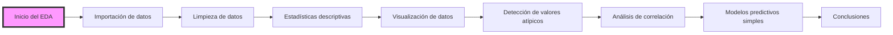
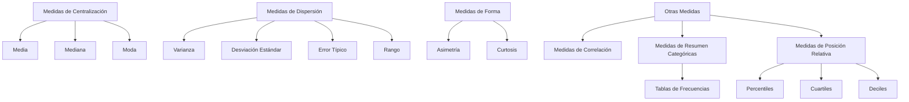

<div style="text-align: center;">
  
</div>

# Análisis Exploratorio de Datos (EDA) en Excel

El **Análisis Exploratorio de Datos (EDA)** es un proceso clave para comprender y analizar un conjunto de datos, buscando patrones, valores atípicos, relaciones entre variables y distribuciones. Aunque Excel no es una herramienta especializada para grandes análisis estadísticos, cuenta con funcionalidades avanzadas que permiten realizar un EDA eficaz. Si bien es cierto que no existe una receta universal para poder hacer un EDA, los principales pasos que deberemos seguir son:




- `Importación de datos`: Esta fase es crucial, ya que define cómo los datos ingresan a Excel desde fuentes externas. 

- `Estadísticas descriptivas`: Las estadísticas descriptivas son la base del EDA. Nos proporcionan un resumen de los principales aspectos de los datos, como la tendencia central, la dispersión y la distribución.

- `Visualización de datos`: Es uno de los componentes más importantes del EDA. A través de gráficos, podemos identificar patrones, tendencias, relaciones y anomalías que pueden no ser evidentes a través de análisis numéricos. Algunas de las gráficas que podremos usar y que más información nos van a dar son: 

    - Gráficos de dispersión: Son ideales para identificar la relación entre dos variables. Nos permiten visualizar si existe una relación positiva, negativa o nula entre las variables.

    - Histogramas: Son útiles para observar la **distribución** de una variable. Nos permiten ver si los datos están distribuidos de manera normal, sesgada o si tienen múltiples picos (bimodalidad).

    - Boxplot (Gráfico de cajas y bigotes): Es una forma eficiente de visualizar la distribución de los datos, incluidos los **cuartiles** y los **valores atípicos**. El boxplot muestra:

        - **Rango intercuartílico (IQR)**: Es la diferencia entre el **primer cuartil (Q1)** y el **tercer cuartil (Q3)**. Q1 representa el valor por debajo del cual se encuentra el 25% de los datos, y Q3 representa el valor por debajo del cual se encuentra el 75% de los datos. El IQR mide la dispersión de los datos centrales y se calcula como: 

            ```
            IQR = Q3 - Q1
            ```

        - **Mediana (Q2)**: Es el valor central de un conjunto de datos ordenados. Es el punto en el que el 50% de los datos son menores y el 50% son mayores. La mediana es menos sensible a los valores atípicos en comparación con la media y es útil para describir la tendencia central de los datos.

        - **Valores atípicos (puntos fuera de los "bigotes")**: Son puntos de datos que se alejan significativamente del resto de los datos. Los valores atípicos se representan como puntos fuera de los "bigotes", que suelen extenderse hasta Q1 - 1.5*IQR** en la parte inferior y **Q3 + 1.5*IQR en la parte superior. Estos valores indican datos que están fuera del rango esperado.


- `Detección de valores atípicos`: Son datos que se alejan significativamente del resto de los valores del conjunto de datos. Detectarlos es crucial, ya que pueden influir en los resultados del análisis y distorsionar las conclusiones.


- `Análisis de correlación`: Mide la fuerza y dirección de la relación entre dos o más variables. Esto es crucial para entender cómo una variable puede influir en otra y puede ser el paso inicial para modelos predictivos más avanzados. El coeficiente de correlación de Pearson (r) es una medida que indica cómo dos variables están relacionadas. El valor varía entre **-1** y **+1**:

  - **+1**: Indica una correlación positiva perfecta (cuando una variable aumenta, la otra también).

  - **-1**: Indica una correlación negativa perfecta (cuando una variable aumenta, la otra disminuye).

  - **0**: Indica que no hay correlación.


- `Limpieza de datos`: La limpieza de datos es esencial para garantizar que el análisis se base en datos precisos y coherentes. Excel proporciona varias herramientas para detectar y corregir errores, valores faltantes o duplicados.


# Estadística descriptiva

La **estadística descriptiva** es una rama de la estadística que se encarga de **describir y resumir** las características de un conjunto de datos. Su objetivo es simplificar/resumir la información y hacer que los datos sean más fáciles de interpretar. 

**¿Por qué debemos extraer las estadísticas descriptivas cuando hacemos un EDA?**

- La estadística descriptiva ayuda a proporcionar un resumen rápido de las principales características de los datos. En lugar de analizar todos los puntos de datos individualmente, podemos observar medidas clave como la media o la desviación estándar para obtener una visión general del conjunto de datos.

- Medidas como la media, la moda, y la mediana permiten descubrir patrones y tendencias. Por ejemplo, si la media de los datos es muy alta o baja, puede dar una idea de la tendencia central de los datos y ayudar a formular hipótesis sobre el comportamiento de la variable.

- Las medidas de dispersión (como el rango o la desviación estándar) permiten detectar **outliers** o valores atípicos que podrían afectar el análisis posterior. Esto es crucial porque los valores atípicos pueden sesgar los resultados de los análisis y modelos predictivos.

- Con medidas como la **curtosis** y el **coeficiente de asimetría**, podemos identificar si los datos están sesgados o tienen una alta concentración de valores extremos, lo que es importante para ajustar correctamente los modelos y suposiciones posteriores.

- La estadística descriptiva permite una fácil comparación entre variables, ayudando a identificar relaciones y posibles correlaciones entre ellas. Este proceso es clave para entender cómo interactúan las variables y qué relaciones pueden existir antes de aplicar modelos más sofisticados.

- Las estadísticas descriptivas pueden ser la base para la creación de visualizaciones de datos como gráficos de barras, histogramas, o diagramas de dispersión, que permiten comunicar de manera clara los resultados iniciales.


## Tipos de Medidas en Estadística Descriptiva

Las medidas en estadística descriptiva se dividen en tres categorías principales:




## Medidas de Centralización

**Las medidas de centralización** son herramientas clave en estadística que nos van a permitir identificar el valor más representativo o típico dentro de un conjunto de datos. Estas medidas ayudan a entender el centro de la distribución de los datos, proporcionando una visión clara de dónde se concentran los valores. Como ya hemos dicho, tenemos tres tipos de medidas de centralización: 

- **Media (Promedio):** La media es el valor promedio de un conjunto de datos. Se calcula sumando todos los valores y dividiéndolos por el número de observaciones. Es útil cuando los datos son bastante homogéneos y no hay valores atípicos extremos.

    Por ejemplo, si se analizan los ingresos mensuales de un grupo de personas y se obtienen los valores $100, $120, $110 y $130, la media sería $115. Esto indica que, en promedio, las personas ganan $115 al mes.

- **Mediana:** La mediana es el valor central en un conjunto de datos ordenados. Si el número de observaciones es impar, la mediana es el valor en el centro. Si es par, es el promedio de los dos valores centrales. Es especialmente útil cuando los datos incluyen valores atípicos que pueden distorsionar la media.

   Por ejemplo, en el análisis de salarios de una empresa, si los salarios son $30,000, $40,000, $50,000, $60,000 y $1,000,000, la mediana sería $50,000. Este valor representa mejor el salario típico que la media, que estaría influenciada por el salario extremo de $1,000,000.

- **Moda:** La moda es el valor que aparece con mayor frecuencia en un conjunto de datos. Es útil para identificar el valor más común o frecuente en un conjunto de datos.

   Por ejemplo, en una encuesta sobre el tipo de coche más popular, si el modelo más frecuentemente mencionado es el Modelo A, entonces la moda es el Modelo A. Esto indica que el Modelo A es el coche más popular entre los encuestados.


## Medidas de Dispersión

**Las medidas de dispersión** son herramientas estadísticas que nos permiten entender cuán dispersos o agrupados están los datos alrededor de las medidas de centralización. Estas medidas complementan a las medidas de centralización proporcionando información sobre la variabilidad de los datos. Las medidas de dispersión más comunes incluyen la varianza, la desviación estándar, el error típico y el rango:

- **Varianza**: Es una medida que cuantifica la dispersión de los datos con respecto a la media. Se calcula promediando el cuadrado de las diferencias entre cada valor y la media. La varianza nos indica cuán separados están los datos en promedio respecto a la media del conjunto.

    Por ejemplo, imaginemos que tenemos las alturas de 5 personas: 160 cm, 165 cm, 170 cm, 175 cm y 180 cm. La varianza de estas alturas te dirá cuánto se desvían las alturas individuales de la media. Una varianza baja indica que las alturas están más cercanas entre sí, mientras que una varianza alta indica que las alturas son más variadas.

- **Desviación Estándar**: Es la raíz cuadrada de la varianza y es quizás la medida de dispersión más utilizada. Al ser la raíz cuadrada de la varianza, la desviación estándar se expresa en las mismas unidades que los datos originales, lo que la hace más fácil de interpretar.

    Por ejemplo, si las alturas de un grupo de personas tienen una desviación estándar de 5 cm, esto significa que, en promedio, las alturas se desvían 5 cm de la media. Cuanto mayor sea la desviación estándar, mayor será la dispersión de los datos. Si es baja, significa que los valores tienden a estar más agrupados alrededor de la media.

- **Error Típico**: Se utiliza principalmente en el análisis de muestras, y mide la precisión con la que la media de una muestra estima la media de la población. Cuanto más pequeño es el error típico, más confiables son las estimaciones basadas en la muestra.

    Por ejemplo, imagina que calculas la media de los ingresos mensuales de una muestra de 100 personas y obtienes un error típico de $50. Esto indica que la media calculada tiene un margen de error de $50 al estimar los ingresos medios de toda la población. Un error típico bajo sugiere que la muestra es un buen representante de la población.

- **Rango**: Es la medida más simple de dispersión y se define como la diferencia entre el valor máximo y el valor mínimo en un conjunto de datos. Es útil para obtener una idea rápida de la variabilidad total de los datos, pero no proporciona información sobre cómo están distribuidos los valores entre el máximo y el mínimo.

    Por ejemplo, si el salario más bajo en una empresa es $20,000 y el más alto es $150,000, el rango sería de $130,000. Esto indica que hay una gran diferencia entre los salarios más bajos y más altos, pero no nos dice cómo se distribuyen los salarios entre esos dos extremos.


## Medidas de Forma

**Las medidas de forma** describen la distribución de los datos en relación con la simetría y el apuntamiento de la curva que representa esa distribución. Estas medidas son importantes para entender cómo se comportan los datos respecto a la media y si existen sesgos o colas largas en la distribución. Las dos medidas de forma más comunes son la **asimetría (skewness)** y la **curtosis**.

- **Asimetría (Skewness)**: Mide el grado de desviación o sesgo de una distribución con respecto a su media. Si la distribución es simétrica, su asimetría es cercana a 0. Existen dos tipos de asimetría:

    - **Asimetría positiva**: Ocurre cuando la cola derecha de la distribución es más larga o tiene más valores que la cola izquierda. Esto significa que los valores altos son más frecuentes que los valores bajos.
    
        Supongamos que analizamos los ingresos de una población y encontramos que la mayoría de las personas ganan salarios bajos o moderados, pero unos pocos ganan salarios muy altos. Esto crearía una **asimetría positiva**, ya que los valores altos (salarios altos) alargan la cola derecha de la distribución.

    - **Asimetría negativa**: Ocurre cuando la cola izquierda de la distribución es más larga o tiene más valores que la derecha. Esto significa que los valores bajos son más frecuentes que los valores altos.

        Si estamos analizando el número de días que tardan en entregarse los pedidos en una empresa y la mayoría de los pedidos se entregan en 1 o 2 días, pero algunos pocos tardan mucho más (7-10 días), esto podría generar una **asimetría negativa**.

- **Curtosis**: Mide el "apuntamiento" de la distribución, es decir, si los datos están concentrados cerca de la media o si se dispersan más hacia los extremos (colas). Al analizar la curtosis, se puede identificar si la distribución tiene colas largas (más valores extremos) o si los datos se agrupan alrededor de la media. Existen dos tipos principales de curtosis:

    - **Curtosis positiva (leptocúrtica)**: Indica que la distribución tiene un apuntamiento elevado y colas más largas y pesadas. Esto significa que hay más valores extremos en los datos, es decir, más valores alejados de la media.

        En el caso de una evaluación de riesgo financiero, si encontramos que hay algunos pocos eventos que generan pérdidas muy grandes, esto indicaría una **curtosis positiva**, ya que hay más valores en las colas de la distribución (pérdidas extremas).

    - **Curtosis negativa (platicúrtica)**: Indica que la distribución tiene un apuntamiento bajo y colas más cortas y ligeras. Esto sugiere que la mayoría de los valores están agrupados alrededor de la media, sin demasiados valores extremos.

        Si se analiza la altura de los estudiantes en una escuela y la mayoría tiene una altura muy cercana a la media (con pocas personas mucho más altas o mucho más bajas), la distribución tendría una **curtosis negativa**.